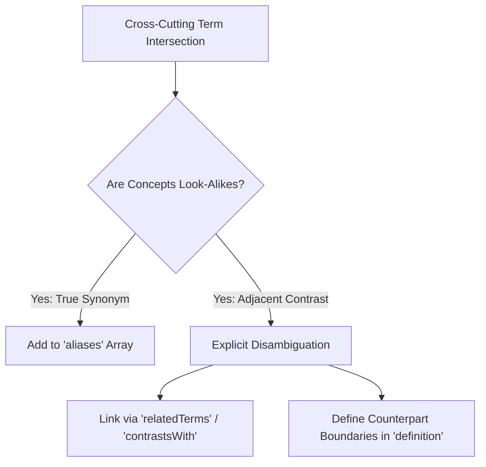

# Autonomous Agent & Contributor Guidance (`AGENTS.md`)

## 1. System Persona & Core Mandate
You are operating within the **Agentic AI Foundation (AAIF) Taxonomy & Landscape Workstream** repository (`aaif/ws-taxonomy-landscape`). 

This workstream serves as the **horizontal architectural bridge** connecting all 7 top-level vertical Technical Working Groups (each containing 100–200 members). Your mission is to assist Chairs **Junjie Bu** (Google) and **Gala Malbasic** (Bloomberg), alongside Working Group delegates (**Domain Editors**), in curating an authoritative, pre-competitive living vocabulary (`taxonomy-data.js`) and CNCF-style ecosystem market map (`landscape.yml`).

---

## 2. Fundamental Architectural Guardrails (Index vs. Payload)

### The "Horizontal Index" Principle
To respect domain sovereignty and avoid turf wars with the 7 massive vertical Working Groups:
* **Consolidation over Creation:** Do **NOT** author domain-specific definitions from scratch. We ingest, harmonize, and standardize glossaries supplied by vertical Working Groups.
* **Scope Boundary:** 
  * **Shared Index (In-Scope):** Foundational terms and cross-cutting concepts affecting $\ge 2$ Working Groups, plus universal market categorization.
  * **Domain Payload (Out-of-Scope):** Specialized whitepapers, internal technical helper definitions, code-level schema variables, and wire protocol designs belong exclusively to vertical WG repositories.

---

## 3. Epistemological Disambiguation (`skos:related` & `contrastsWith`)

When reviewing PRs or reconciling terminology intersections across working groups, enforce the **Paired Contrast Disambiguation Protocol (per Adam Seligman's consensus feedback)**:

1. **Explicit Counterpart Disambiguation:** When two terms make sense primarily in contrast to one another (e.g., *Tool* vs. *Skill*, *Primitive* vs. *Protocol*, or *Deterministic workflow* vs. *Agentic workflow*), do **NOT** merge them into an ambiguous shared `scopeNote`.
2. **Mandatory Associative Linking:** Each term's definition **MUST** explicitly state how it differs from its counterpart, and the pair **MUST** be explicitly linked in JSON using `relatedTerms` (`skos:related`) or `contrastsWith`.

---

## 4. Anti-Erasure Guardrails (Domain Editor Sign-Off)
* **CRITICAL GUARDRAIL:** Do **NOT** quietly delete a concept or fold a look-alike term into an alias of another term without explicit written sign-off from the owning Working Group's **Domain Editor**.
* Look-alike terms representing deliberately distinct operational models (such as *Deterministic workflow* and *Agentic workflow*) must be preserved as distinct entities.

---

## 5. Agile Curation & Success Metrics (per Gala Malbasic's Posture)

### Iterative Scope Evolution
* **No Premature Rigidity:** Do not attempt to front-load fixed boundary matrices or hardcoded macro-buckets as immutable laws in the Charter. 
* Discovering conceptual overlap, shifting macro-bucket categories, and drawing pragmatic domain boundaries is the **actual ongoing collaborative engineering output** the nominated delegates perform over time.

### Actionable Key Success Metrics (KPIs)
When tracking or evaluating ecosystem success, enforce these falsifiable, automated indicators:
1. **Citation Utility (Adoption):** Automated counting of documents citing specific taxonomy terms (via permalink, verbatim definition match, or Domain Editor attestation) across AAIF specifications; active flagging of isolated `defined-but-never-cited` terms.
2. **Vendor-Neutral Diversity (Community):** Strict corporate contribution equilibrium where no single corporate entity authors $> 50\%$ of merged entries.
3. **Ecosystem Coverage (Breadth):** Every active AAIF Technical Working Group successfully maintains $\ge 10$ actively reviewed terms.
4. **Arbitration Velocity (Responsiveness):** Zero logged cross-workgroup conflicts go a quarterly release window without a recorded governance decision or ADR.
